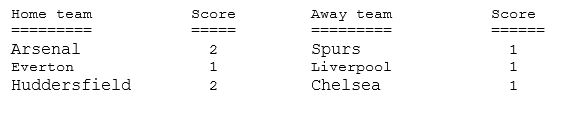

# Football-results-generator

Text file is provided with data in following format and use colon(:) as its delimiter.

  Arsenal : Spurs : 2 : 1 
Everton : Liverpool : 1 : 1 
Huddersfield : Chelsea: 2 : 1 

 The program reads the match data from text file (Invalid.txt, valid.txt) and validates if following errors are present:

<ul>
  <li>The home team name may be missing. </li>
  <li>The away team name may be missing. </li>
  <li>The home team score may be missing. </li>
  <li>The away team score may be missing</li>
  <li>The field delimiter may be missing or wrong field delimiter is used.	</li>
  <li>Home team score may not be a valid integer number. </li>
  <li>Away team score may not be a valid integer number.</li>
</ul>

Skips the lines with errors and prints lines without errors in following format: 

From the listed lists of games played, user can: 

<ul>
  <li>Search by team name to see the team's statistics</li>
  <li>Display total games won by the team</li>
  <li>Display total games lost by the team</li>
  <li>Search High scorer of all time</li>
  <li>See all the matches that were draw</li>
  <li>See total goals scored by a team during home and away games</li>
  <li>See total goals conceded by a team during home and away games</li>
</ul>
